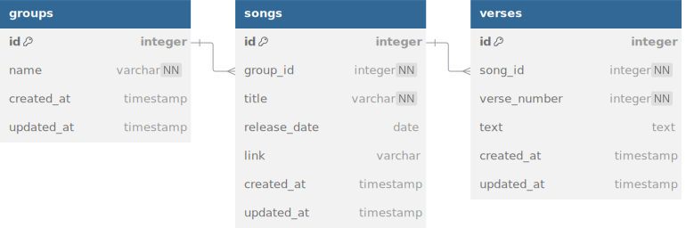

# Онлайн библиотека для Effective mobile 
![Project language][badge_language]

### УСЛОВИЕ ТЕСТОВОГО ЗАДАНИЯ БЫЛО В ДОСТАТОЧНО СВОБОДНОЙ ФОРМЕ - ЕСЛИ ПРИ ПРОВЕРКЕ ВОЗНИКЛИ ВОПРОСЫ, ПОЖАЛУЙСТА, СВЯЖИТЕСЬ СО МНОЙ - @s0vunia (telegram)

## Запуск проекта
1. Клонируйте репозиторий:
```bash
git clone https://github.com/s0vunia/effective-mobile.git
cd effective-mobile
```

2. Создайте файл `.env` на основе `.env.dist`:
```bash
cp .env.dist .env
```

3. Запустите проект через Makefile или DockerCompose:
```bash
make local-docker-compose-up
```
или
```bash
docker compose up --build -d
```

4. [swagger.json](./api/swagger/swagger.json) / [swagger.yaml](./api/swagger/swagger.yaml) - Swagger-документация

## Технологии и инструменты
- Go 1.23, Echo
- PostgreSQL с Goose для миграций
- Структурированное логирование с помощью Zap
- Swag для генерации Swagger-документации
- Makefile для упрощения команд
- **Дополнительно**:
   - golangci-lint для статического анализа

## Архитектура
Проект построен с использованием слоистой архитектуры:

- **API** (`/api`) - Обработка HTTP-запросов и ответов
- **Service** (`/service`) - Бизнес-логика приложения
- **Repository** (`/repository`) - Взаимодействие с базой данных
- **Model** (`/model`) - Доменные модели и бизнес-правила
- **DTO** (`/dto`) - Объекты передачи данных
- **Config** (`/config`) - Конфигурация приложения
- **Middlewares** (`/middlewares`) - Промежуточные обработчики (логирование)

## Схема БД


[badge_language]:https://img.shields.io/badge/language-go_1.23-blue.svg?longCache=true